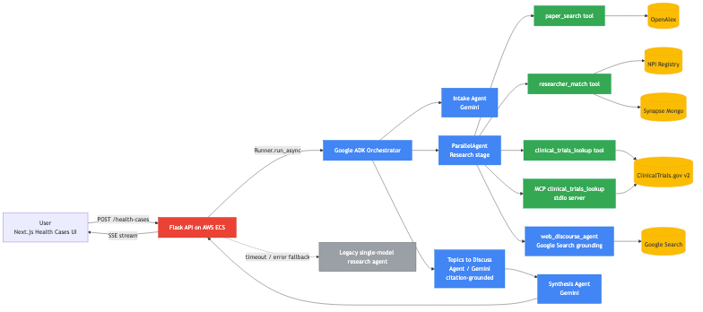

# Synapse Health Cases — Google ADK Multi-Agent Research

> **A curated public slice of the production codebase powering
> [`https://synapsesocial.com/health-cases`](https://synapsesocial.com/health-cases).**
>
> Submitted to the
> [Google for Startups AI Agents Challenge](https://googleforstartups-aiagents.devpost.com/) —
> Track: **Build / Net-New Agent**.



## What this agent does

A user pastes a free-text medical case — for example, *"67-year-old with vision
loss, MacTel, type-2 diabetes, and stage-3A CKD"* — and the agent returns a
structured **Expert Research brief** containing:

- Relevant published papers (with citations)
- Named researchers worth consulting, with affiliations
- Ongoing and recruiting clinical trials
- **Citation-grounded conversation topics to discuss with the patient's
  specialist** — every bullet must cite a paper/trial/researcher already in
  the brief, never recommends specific doses, and falls back to a disclaimer
  if the agent cannot ground at least three topics safely
- A personalized literature feed

…all grounded in real sources, streamed token-by-token to the browser, and
downloadable as a PDF.

See [`examples/67M-mactel-diabetes-ckd-brief.md`](examples/67M-mactel-diabetes-ckd-brief.md)
and the matching [PDF](examples/67M-mactel-diabetes-ckd-brief.pdf) for a real
production output captured on 2026-05-26.

## Why Google ADK

We needed four things that map cleanly onto ADK primitives:

1. **Multi-Agent Orchestration** with ADK's `ParallelAgent` — runs
   `paper_search`, `researcher_match`, `clinical_trials_lookup`, and
   **Grounding with Google Search** (`web_discourse_agent`) concurrently.
   p50 brief generation latency dropped roughly **2×** compared with our prior
   sequential single-model path.
2. **Sequential orchestration** of intake → research → topics → synthesis, with
   a dedicated Gemini agent for the citation-grounded "Topics to Discuss"
   step that the final synthesis agent drops in verbatim. ADK's
   `SequentialAgent` composes these in one declarative chain.
3. **MCP-native tool consumption** — `clinical_trials_lookup` is exposed over
   the Model Context Protocol via a stdio MCP server and consumed by ADK's
   `McpToolset`, matching the challenge guide's Build-track requirement for
   agents that securely connect to external tools over MCP.
4. **Custom Python tools** wrapped around our existing Synapse research
   stack — every tool is a thin adapter over an executor we already ship in
   production, so the ADK rewrite was a one-day integration rather than a
   re-implementation.
5. **Structured Output** — the Topics agent returns a constrained markdown
   block (disclaimer + citation-grounded bullets) that synthesis drops in
   verbatim under section 5.
6. **Agent Evaluation** — a curated 4-case golden brief eval set
   (`backend/tests/health_cases/golden_briefs.yaml`) with an ADK-compatible
   `.evalset.json` and `make adk-eval` scorecard runner for baseline
   measurement.
7. **Per-agent prompt isolation** — the "Topics to Discuss" agent has very
   different safety constraints from the research agents (no doses, no
   instructions, mandatory citation). Having it as its own ADK agent with
   its own prompt and output key lets us reason about that contract
   independently from the broader research and synthesis prompts.

A legacy single-model research agent stays wired up as an **automatic fallback**
inside the Flask route (`backend/api/routes/health_case/__init__.py`). If ADK
times out or errors *before* yielding any events, we transparently fall back.
If ADK errors *mid-stream* after partial events, we surface a clean error
without garbling the client (the `adk_yielded` flag pattern — see the route).

## Live demo and artifacts

- **Live app**: <https://synapsesocial.com/health-cases>
- **Architecture deep-dive**: [`docs/google-adk-health-cases-architecture.md`](docs/google-adk-health-cases-architecture.md)
- **Example brief** (markdown): [`examples/67M-mactel-diabetes-ckd-brief.md`](examples/67M-mactel-diabetes-ckd-brief.md)
- **Example brief** (PDF, rendered Node-side from the same React components the web app uses): [`examples/67M-mactel-diabetes-ckd-brief.pdf`](examples/67M-mactel-diabetes-ckd-brief.pdf)

## Repo layout

```
backend/
  services/health_cases_adk.py       # ADK Runner, tool wrappers, intake & brief streaming
  api/routes/health_case/__init__.py # Flask SSE routes + ADK/legacy fallback wiring
  api/models/health_case/__init__.py # MongoEngine model for Health Cases
  tests/test_health_cases_adk.py     # Unit tests for the ADK path
frontend/
  components/HealthCasesClient.tsx   # React UI consuming the SSE stream
  components/BriefPdfDocument.tsx    # @react-pdf/renderer document
  components/briefPdf.ts             # Brief markdown → PDF section parser
  scripts/render-brief-pdf.tsx       # Node-side PDF renderer (re-uses the web component)
docs/
  google-adk-health-cases-architecture.md
  architecture.png                   # Source: docs/architecture.mmd (Mermaid)
examples/
  67M-mactel-diabetes-ckd-brief.md   # Real captured ADK output
  67M-mactel-diabetes-ckd-brief.pdf  # Same brief, rendered to PDF
```

## Technology stack

- **Agent framework**: [Google Agent Development Kit (ADK) 2.1](https://adk.dev) — `SequentialAgent`, `ParallelAgent`, MCP `McpToolset`, Grounding with Google Search, custom `Tool`s
- **LLM**: Google Gemini (via `google-genai >= 1.72`)
- **Prompt iteration**: Google AI Studio
- **API**: Python 3.11, Flask, Server-Sent Events (SSE)
- **Web**: Next.js 14, React, @react-pdf/renderer
- **Hosting**: AWS ECS Fargate (API), Vercel (web)
- **Data sources**: OpenAlex, PubMed E-utilities, ClinicalTrials.gov v2, NPI Registry, Synapse-owned Mongo corpus
- **Observability**: Sentry

## Reading order for judges

If you're reviewing this in 10 minutes, read these four files in this order:

1. [`docs/google-adk-health-cases-architecture.md`](docs/google-adk-health-cases-architecture.md) — the design doc
2. [`backend/services/health_cases_adk.py`](backend/services/health_cases_adk.py) — the agent + tool wiring (this is the core file)
3. [`backend/api/routes/health_case/__init__.py`](backend/api/routes/health_case/__init__.py) — the Flask route, SSE event contract, and ADK→legacy fallback
4. [`examples/67M-mactel-diabetes-ckd-brief.md`](examples/67M-mactel-diabetes-ckd-brief.md) — a real captured output

## Note on this repo's scope

This is a **read-only mirror** of the ADK Health Cases feature — the files
above are extracted verbatim from our production monorepo. It is *not*
runnable standalone; some imports reference broader Synapse infrastructure
(MongoEngine models, our research executor, Firebase auth) that lives in the
private monorepo.

The intent is to make the ADK integration auditable for the Devpost judges
without exposing unrelated product surfaces. If you'd like deeper access,
contact `jesse@synapsesocial.com`.

## License

MIT — see [LICENSE](LICENSE).
