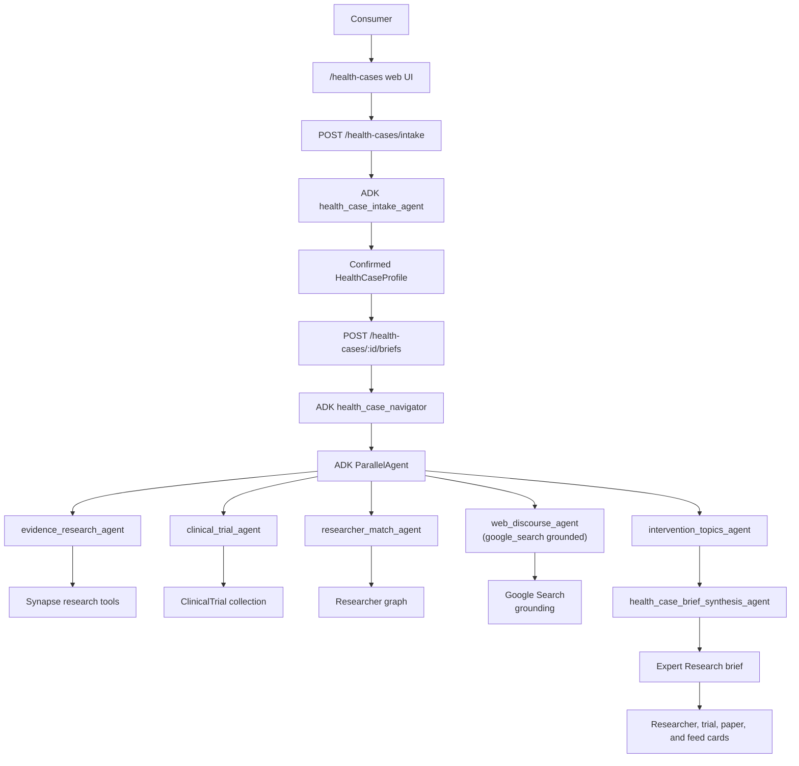

# Google ADK Health Cases Architecture

## Competition Positioning

Synapse Health Case Navigator is the Build-track submission for the Google for
Startups AI Agents Challenge. The user-facing product is Health Cases: a
consumer enters a cardiology case story, optionally uploads records, confirms
the extracted facts, and receives a cited Expert Research brief with relevant
research papers, researchers or centers to contact, clinical trials, and feed
suggestions.

The ADK build turns the brief step from a single hand-rolled research-agent
prompt into a multi-agent workflow:

- `health_case_intake_agent` structures the case story and uploaded record text
  into a user-confirmed profile.
- `evidence_research_agent` retrieves papers, guidelines, consensus, and
  evidence graph context.
- `clinical_trial_agent` retrieves relevant ClinicalTrials.gov studies.
- `researcher_match_agent` finds researchers, trialists, and centers through
  Synapse's researcher graph.
- `web_discourse_agent` runs in parallel and is grounded with ADK's built-in
  ``google_search`` tool (Gemini-native Google Search grounding). It pulls
  real-time signals -- FDA/EMA announcements, late-breaking conference results,
  guideline updates not yet in PubMed, and credible X/web discourse -- that
  static literature retrieval would miss. If the running ADK version does not
  expose ``google.adk.tools.google_search``, the agent is silently omitted and
  the rest of the workflow proceeds unchanged.
- `intervention_topics_agent` distills the parallel research outputs into a
  citation-grounded "Topics to Discuss With Your Specialist" block. It NEVER
  recommends treatments or doses; it phrases each bullet as a question or topic
  to raise, must cite a paper/NCT ID/researcher already in the inputs, and is
  prompted with a hard rule to fall back to a disclaimer-only output if it
  cannot ground three topics safely.
- `health_case_brief_synthesis_agent` produces the final user-facing brief with
  the same section contract the web UI already renders, dropping the topics
  block verbatim under section 5 to avoid re-summarization drift.

## Runtime Flow

## Tool Boundary

`backend/services/health_cases_adk.py` wraps existing Synapse tool executors
rather than duplicating retrieval logic. The ADK tools call:

- `paper_search`
- `evidence_lookup`
- `guideline_lookup`
- `clinical_trials_lookup`
- `researcher_match`

The adapter records tool outputs and maps them back to the existing SSE event
shape so `frontend/web/src/app/hooks/useHealthCases.ts` continues to receive
`content`, `tool_result`, `brief_saved`, `error`, and `done` events.

## Safety And Privacy

- Health Cases routes remain authenticated. Anonymous access is not allowed.
- Uploaded records are stored under PHI-scoped S3 keys and encrypted at rest.
- Raw extracted record text is not stored in Mongo summaries.
- The ADK path preserves existing fallbacks: when `google-adk` is missing or an
  ADK run fails, the route logs the issue and uses the legacy research agent.
- `HEALTH_CASE_AGENT_BACKEND` defaults to `adk` so the multi-agent workflow is
  the production code path; the legacy executor stays wired in as an automatic
  fallback. Set `HEALTH_CASE_AGENT_BACKEND=legacy` in an environment to opt
  back out (e.g. for incident response).

## Demo Checklist

- Use a synthetic cardiology case, not real PHI.
- Show intake from plain English plus a synthetic record.
- Confirm the structured profile before generation.
- Generate the Expert Research brief and point out the ADK multi-agent badge.
- Open the clinical trial cards and ClinicalTrials.gov links.
- Use a researcher `Request Contact` card.
- Download the PDF brief.

