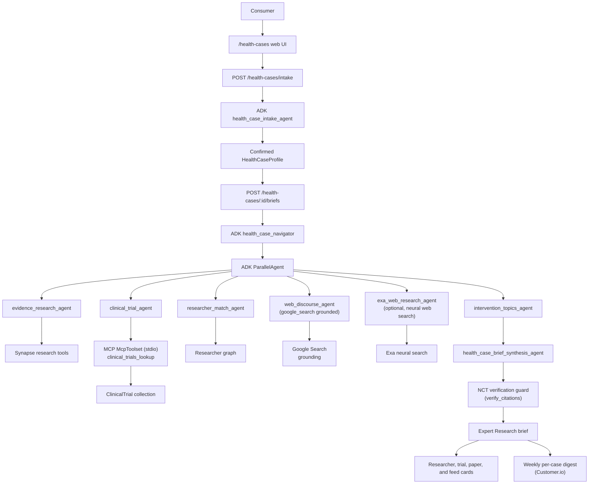

# Google ADK Health Cases Architecture

## Competition Positioning

Synapse Health Case Navigator is the Build-track submission for the Google for
Startups AI Agents Challenge. The user-facing product is Health Cases: a
consumer enters a cardiology case story, optionally uploads records, confirms
the extracted facts, and receives a cited Expert Research brief with relevant
research papers, researchers or centers to contact, clinical trials, and feed
suggestions.

The ADK build turns the brief step from a single hand-rolled research-agent
prompt into a multi-agent workflow:

- `health_case_intake_agent` structures the case story and uploaded record text
  into a user-confirmed profile (separate route — not part of
  `health_case_navigator`).
- `evidence_research_agent` retrieves papers, guidelines, consensus, and
  evidence graph context.
- `clinical_trial_agent` retrieves relevant ClinicalTrials.gov studies.
- `researcher_match_agent` finds researchers, trialists, and centers through
  Synapse's researcher graph.
- `web_discourse_agent` runs in parallel and is grounded with ADK's built-in
  ``google_search`` tool (Gemini-native Google Search grounding). It pulls
  real-time signals -- FDA/EMA announcements, late-breaking conference results,
  guideline updates not yet in PubMed, and credible X/web discourse -- that
  static literature retrieval would miss. If the running ADK version does not
  expose ``google.adk.tools.google_search``, the agent is silently omitted and
  the rest of the workflow proceeds unchanged.
- `exa_web_research_agent` is an optional fifth parallel sub-agent that broadens
  discovery via Exa neural web search (guideline pages, society/position
  statements, regulatory pages, reputable news) that structured databases miss.
  It is opt-in behind ``HEALTH_CASE_ENABLE_EXA`` (default off) and degrades
  cleanly when the flag or API key is absent, mirroring the `web_discourse_agent`
  pattern.
- `intervention_topics_agent` distills the parallel research outputs into a
  citation-grounded "Topics to Discuss With Your Specialist" block. It NEVER
  recommends treatments or doses; it phrases each bullet as a question or topic
  to raise, must cite a paper/NCT ID/researcher already in the inputs, and is
  prompted with a hard rule to fall back to a disclaimer-only output if it
  cannot ground three topics safely.
- `health_case_brief_synthesis_agent` produces the final user-facing brief with
  the same section contract the web UI already renders, dropping the topics
  block verbatim under section 5 to avoid re-summarization drift.

## Runtime Flow

See [`architecture.png`](architecture.png) (source: [`architecture.mmd`](architecture.mmd)).

## Model tiering

Parallel research sub-agents and the topics extractor run on the fast Gemini
Flash tier (`HEALTH_CASE_ADK_FAST_MODEL`, default `gemini-3.5-flash`) because
that fan-out is tool-calling-heavy and latency-bound. Final synthesis runs on
the pro tier (`HEALTH_CASE_ADK_MODEL`, default `gemini-3.1-pro-preview`) where
reasoning quality matters most.

## Tool Boundary

`backend/services/health_cases_adk.py` wraps existing Synapse tool executors
rather than duplicating retrieval logic. The ADK tools call:

- `paper_search`
- `evidence_lookup`
- `guideline_lookup`
- `clinical_trials_lookup`
- `researcher_match`

The adapter records tool outputs and maps them back to the existing SSE event
shape so `frontend/web/src/app/hooks/useHealthCases.ts` continues to receive
`content`, `tool_result`, `brief_saved`, `error`, and `done` events.

### MCP boundary

Trial lookup is consumed across the Model Context Protocol boundary. When MCP
is enabled (`HEALTH_CASE_ENABLE_MCP`, default on), `_build_mcp_toolset()` spawns
the Synapse MCP server (`services.mcp.synapse_mcp_server`) over stdio and
exposes it to `clinical_trial_agent` via ADK's `McpToolset` (filtered to
`clinical_trials_lookup`). Because the MCP server publishes the same function
name as the inline tool, passing both makes Gemini reject the request with a
duplicate-declaration error — so the trial agent strips the inline
`clinical_trials_lookup` and the MCP toolset wins. If the toolset can't be
built, the agent falls back to the inline function tool rather than failing
closed.

## Citation Grounding Guard

After synthesis, `verify_citations` (in
`backend/services/research_agent_extensions.py`) scans the brief for NCT IDs and
checks them against the Synapse-synced `ClinicalTrial` registry collection (a
synced mirror of ClinicalTrials.gov). IDs the model invented don't resolve and
are returned in `unverified_ncts`. The streamed text is not mutated; the
`done` event carries `citation_grounding` metadata so the client can render a
"couldn't verify these references" warning rather than silently trusting an
unverified brief. The guard runs only when `grounding_enabled()` and is skipped
(with a Sentry breadcrumb) if there is no brief text to scan.

## Weekly Per-Case Digest

`backend/cron/health_case_digest.py` assembles a "what's new since your last
update" email for each Health Case whose owner opted in (`digest_enabled`).
`build_case_digest` (in `backend/services/health_case_digest_builder.py`) runs
papers/trials/discourse lookups scoped to the case's condition terms and diffs
them against the prior brief's source IDs (and recent digests) so the same item
isn't re-sent. Delivery routes through Customer.io
(`health_case_digest_ready` event), reusing `cron/weekly_digest.py`'s
delivery/eligibility/observability helpers.

## Safety And Privacy

- Health Cases routes remain authenticated. Anonymous access is not allowed.
- Uploaded records are stored under PHI-scoped S3 keys and encrypted at rest.
- Raw extracted record text is not stored in Mongo summaries.
- The ADK path preserves existing fallbacks: when `google-adk` is missing or an
  ADK run fails, the route logs the issue and uses the legacy research agent.
- `HEALTH_CASE_AGENT_BACKEND` defaults to `adk` so the multi-agent workflow is
  the production code path; the legacy executor stays wired in as an automatic
  fallback. Set `HEALTH_CASE_AGENT_BACKEND=legacy` in an environment to opt
  back out (e.g. for incident response).

## Demo Checklist

- Use a synthetic cardiology case, not real PHI.
- Show intake from plain English plus a synthetic record.
- Confirm the structured profile before generation.
- Generate the Expert Research brief and point out the ADK multi-agent badge.
- Open the clinical trial cards and ClinicalTrials.gov links.
- Use a researcher `Request Contact` card.
- Download the PDF brief.

